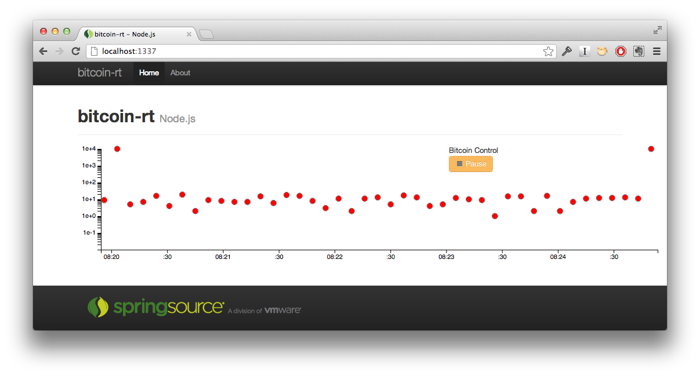
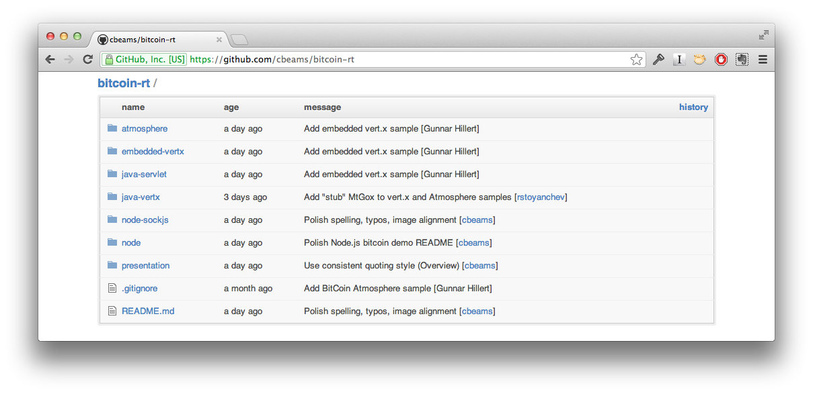

!SLIDE cover
# Intro to WebSockets

## Chris Beams
## Gunnar Hillert
## Rossen Stoyanchev

!SLIDE bullets
# Objective

* Survey the lay of the land
* Less focus on syntax and mechanics
* Broad, pragmatic perspective
* Special emphasis on Java

!SLIDE
# This Presentation
## [http://cbeams.github.com/bitcoin-rt](http://cbeams.github.com/bitcoin-rt)

!SLIDE subsection
# WebSocket 101

!SLIDE bullets incremental
# The Problem
* Some web apps need two-way communication / rapid updates
* AJAX and Comet techniques can amount to an  "abuse of HTTP"

!SLIDE bullets incremental
# The Problem
* Too many connections
* Too much overhead
* Too great a burden on the client

!SLIDE bullets incremental
# The Usual Suspects
* Trading
* Chat
* Gaming
* Collaboration
* Visualization

.notes :
* show Asana

!SLIDE
# The Goal

## _"provide a mechanism for browser-based applications that need two-way communication with servers that does not rely on opening multiple HTTP connections"_

\- [RFC 6455](http://www.ietf.org/rfc/rfc2616.txt), <i>The WebSocket Protocol</i>

!SLIDE bullets incremental
# The Approach
* Two-way messaging over a single connection
* Layer on TCP
* Not HTTP, but uses HTTP to bootstrap
* Extremely low-overhead

!SLIDE small
# The WebSocket HTTP Handshake

    GET /chat HTTP/1.1
    Host: server.example.com
    Upgrade: websocket
    Connection: Upgrade

    HTTP/1.1 101 Switching Protocols
    Upgrade: websocket
    Connection: Upgrade

.notes :
TODO: use actual example from demos or from websockets.org
* mention something about original intent of 101/Upgrade, i.e. for upgrading
to newer versions of HTTP, not necessarily another protocol entirely.

!SLIDE smaller
# What's in a Frame?

         0                   1                   2                   3
         0 1 2 3 4 5 6 7 8 9 0 1 2 3 4 5 6 7 8 9 0 1 2 3 4 5 6 7 8 9 0 1
        +-+-+-+-+-------+-+-------------+-------------------------------+
        |F|R|R|R| opcode|M| Payload len |    Extended payload length    |
        |I|S|S|S|  (4)  |A|     (7)     |             (16/64)           |
        |N|V|V|V|       |S|             |   (if payload len==126/127)   |
        | |1|2|3|       |K|             |                               |
        +-+-+-+-+-------+-+-------------+ - - - - - - - - - - - - - - - +
        |     Extended payload length continued, if payload len == 127  |
        + - - - - - - - - - - - - - - - +-------------------------------+
        |                               |Masking-key, if MASK set to 1  |
        +-------------------------------+-------------------------------+
        | Masking-key (continued)       |          Payload Data         |
        +-------------------------------- - - - - - - - - - - - - - - - +
        :                     Payload Data continued ...                :
        + - - - - - - - - - - - - - - - - - - - - - - - - - - - - - - - +
        |                     Payload Data continued ...                |
        +---------------------------------------------------------------+

[http://www.ietf.org/rfc/rfc6455.txt](http://www.ietf.org/rfc/rfc6455.txt)

!SLIDE subsection bullets incremental
 
# `bitcoin-rt`
* visualize [Bitcoin](http://weusecoins.com) transactions in real time
* inspired by original [bitcoinmonitor.com](http://bitcoinmonitor.com)

!SLIDE center

.notes :
* briefly explain bitcoin
* actually show bitcoinmonitor, show long-polling with chrome dev tools
* start up

!SLIDE bullets incremental
# `bitcoin-rt vs bitcoinmonitor`
* WebSockets instead of [long polling](http://en.wikipedia.org/wiki/Push_technology#Long_polling)
* [d3.js](http://d3js.org) instead of [JQuery UI](http://jqueryui.com/)
* [MongoDB](http://www.mongodb.org) for persistence

!SLIDE center

!SLIDE bullets
# `bitcoin-rt` implementations
* [Node.js](http://nodejs.org)
* Node.js + [SockJS](http://sockjs.org)
* Java + [Tomcat native WebSocket API](http://tomcat.apache.org/tomcat-7.0-doc/web-socket-howto.html)
* Java + [Atmosphere](https://github.com/Atmosphere/atmosphere#readme)
* Java + [Vert.x](http://vertx.io)

!SLIDE center

!SLIDE
# demo source
## [http://github.com/cbeams/bitcoin-rt](http://github.com/cbeams/bitcoin-rt)

!SLIDE subsection
# `bitcoin-rt: Node.js demo`
.notes :
* show mongod running
* show client code

!SLIDE bullets incremental
# WebSocket benefits
* more resource-efficient
* lower-latency data
* conceptually simpler

!SLIDE bullets incremental
# if WebSocket is so great...
* Why does bitcoinmonitor use long polling?
* What about [other sites](https://app.asana.com/0/2178923938044/2178923938044)?

!SLIDE center
# Browser Support

!SLIDE center
# Browser Share World-Wide

!SLIDE center
# Browser Share China

!SLIDE center
# Browser Versions

!SLIDE small bullets incremental
# HTTP Proxies
* Content caching, internet connectivity, filtering
* Can monitor or close connections, buffer unencrypted traffic
* Designed for HTTP-based document transfer
* Not for long-lived connections

!SLIDE quote
# Proxy Traversal
## _"Today, most transparent proxy servers will not yet be familiar with the Web Socket protocol and these proxy servers will be unable to support the Web Socket protocol"_

\- Peter Lubbers, in a 2010 [InfoQ article](http://www.infoq.com/articles/Web-Sockets-Proxy-Servers)

!SLIDE small bullets incremental
# Upgrade Issues

* Explicit proxies with HTTP Connect
* Transparent proxies propagation of `Upgrade` header
* Retaining the `Connection` header
* WebSocket frames vs HTTP traffic

!SLIDE small bullets incremental
# A Few Rules of Thumb
* `"wss:"` provides a much better chance of success
* Same for browsers using explicit proxies
* Transparent proxies can support WebSocket  but must be configured explicitly

!SLIDE small bullets incremental
# Keeping Connections Alive
* Internet inherently unreliable
* Both server and client can go away
* Wireless connection may fade out
* and so on

!SLIDE small bullets incremental
# A New Set of Challenges
* Keep-alive ("ping!")
* Heartbeat ("I'm still here!")
* Message delivery guarantee
* Buffering

