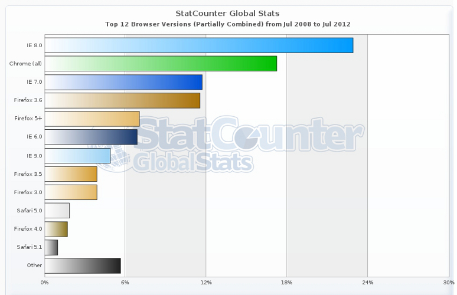

!SLIDE cover
# Intro to WebSockets

## Chris Beams
## Gunnar Hillert
## Rossen Stoyanchev

!SLIDE bullets
# Objective

* Survey the lay of the land
* Less focus on syntax and mechanics
* Broad, pragmatic perspective
* Special emphasis on Java

!SLIDE bullets
# Source

* presentation source  [http://cbeams.github.com/bitcoin-rt](http://cbeams.github.com/bitcoin-rt)
* bitcoin-rt demo source  [http://github.com/cbeams/bitcoin-rt](http://github.com/cbeams/bitcoin-rt)

!SLIDE subsection
# WebSockets ... 101

!SLIDE smaller
# WebSockets ... 101
      0                   1                   2                   3
      0 1 2 3 4 5 6 7 8 9 0 1 2 3 4 5 6 7 8 9 0 1 2 3 4 5 6 7 8 9 0 1
     +-+-+-+-+-------+-+-------------+-------------------------------+
     |F|R|R|R| opcode|M| Payload len |    Extended payload length    |
     |I|S|S|S|  (4)  |A|     (7)     |             (16/64)           |
     |N|V|V|V|       |S|             |   (if payload len==126/127)   |
     | |1|2|3|       |K|             |                               |
     +-+-+-+-+-------+-+-------------+ - - - - - - - - - - - - - - - +
     |     Extended payload length continued, if payload len == 127  |
     + - - - - - - - - - - - - - - - +-------------------------------+
     |                               |Masking-key, if MASK set to 1  |
     +-------------------------------+-------------------------------+
     | Masking-key (continued)       |          Payload Data         |
     +-------------------------------- - - - - - - - - - - - - - - - +
     :                     Payload Data continued ...                :
     + - - - - - - - - - - - - - - - - - - - - - - - - - - - - - - - +
     |                     Payload Data continued ...                |
     +---------------------------------------------------------------+

[http://www.ietf.org/rfc/rfc6455.txt](http://www.ietf.org/rfc/rfc6455.txt)

!SLIDE small
# WebSockets ... 101

    GET /mychat HTTP/1.1
    Host: server.example.com
    Upgrade: websocket
    Connection: Upgrade
    Sec-WebSocket-Key: x3JJHMbDL1EzLkh9GBhXDw==
    Sec-WebSocket-Protocol: chat
    Sec-WebSocket-Version: 13
    Origin: http://example.com

    HTTP/1.1 101 Switching Protocols
    Upgrade: websocket
    Connection: Upgrade
    Sec-WebSocket-Accept: HSmrc0sMlYUkAGmm5OPpG2HaGWk=
    Sec-WebSocket-Protocol: chat

!SLIDE small
## something about original intent of 101/Upgrade?

## [http://www.ietf.org/rfc/rfc2616.txt](http://www.ietf.org/rfc/rfc2616.txt)

!SLIDE center
# Browser Support

!SLIDE center
# Browser Share (World-Wide)

!SLIDE center
# Browser Share (China)

!SLIDE center
# Browser Versions

!SLIDE small bullets incremental
# Proxy Traversal
* HTTP Proxies designed for document transfer
* Not for streaming or idle connections
* Indistinguishable from unresponsive HTTP server
* Proxies may also buffer unencrypted responses

!SLIDE quote
# Proxy Traversal
_"Today, most transparent proxy servers will not yet be 
familiar with the Web Socket protocol and these proxy servers 
will be unable to support the Web Socket protocol"_

Peter Lubbers  
[http://www.infoq.com/articles/Web-Sockets-Proxy-Servers](http://www.infoq.com/articles/Web-Sockets-Proxy-Servers)

!SLIDE small bullets incremental
# A Few Rules of Thumb
* `"wss:"` provides a much better chance of success
* Browsers using explicit proxy will likely work
* Transparent proxies can support WebSocket
* but must be configured explicitly

!SLIDE small bullets incremental
# Keeping Connections Alive
* Internet inherently unreliable
* Both server and client can go away
* Wireless connection may fade out
* ...

!SLIDE small bullets incremental
# A New Set of Challenges
* Keep-alive ("ping!")
* Heartbeat ("i'm still here!")
* Message delivery guarantee
* Buffering

